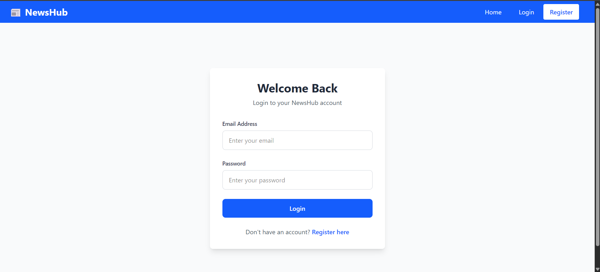
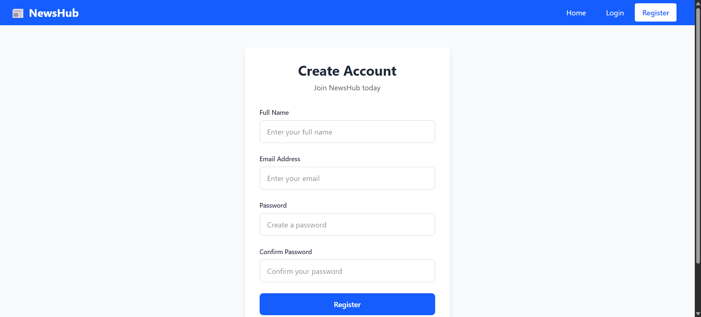

# 📰 News Website

A **full-stack MERN news application** that allows users to explore the latest news articles, register/login securely using **Passport.js**, and bookmark favorite articles.  
The app fetches real-time news using the **NewsAPI (news.org)** and provides a responsive, modern interface built with **React**.

**Link for Demo**: https://news-website-ashy-gamma.vercel.app/

---

## 🚀 Tech Stack

| Layer              | Technology                               |
| ------------------ | ---------------------------------------- |
| **Frontend**       | React.js (Vite), Axios, React Router DOM |
| **Backend**        | Express.js, Node.js                      |
| **Authentication** | Passport.js (JWT Strategy)               |
| **Database**       | MongoDB (Mongoose ORM)                   |
| **API Provider**   | [NewsAPI.org](https://newsapi.org/)      |
| **Hosting**        | Render (Backend) & Vercel (Frontend)     |

---

## ⚙️ Features

- 🔐 **User Authentication** using Passport.js (Register/Login with JWT)
- 📰 **Fetch Latest News** dynamically from [NewsAPI.org](https://newsapi.org/)
- 🔎 **Filter by Category and Source**
- 📌 **Bookmark Articles** for logged-in users
- 💾 **MongoDB Integration** for persistent storage
- ⚡ **CORS-enabled Backend** for secure cross-origin access
- 🌐 **Fully Deployed** on Render + Vercel

---

## 📁 Project Structure

```yaml
news-website/
├── backend/
│ ├── config/
│ │ ├── db.js
│ │ └── passport.js
│ ├── routes/
│ │ ├── auth.js
│ │ ├── news.js
│ │ ├── articles.js
│ │ └── bookmarks.js
│ ├── server.js
│ └── .env
│
└── frontend/
├── src/
│ ├── components/
│ ├── context/
│ ├── pages/
│ ├── utils/api.js
│ ├── App.jsx
│ └── main.jsx
├── .env.production
├── vite.config.js
└── package.json
```

## Backend setup (Express + MongoDB)

1. Navigate to backend folder
```bash
cd backend
```

2. Install dependencies
```bash
npm install
```

3. Create a .env file
```bash
MONGO_URI=your_mongodb_connection_string
JWT_SECRET=your_jwt_secret
NEWS_API_KEY=your_newsapi_key
PORT=5000
```

4. Run the server
```bash
npm start
```

## Frontend Setup (React)

1. Navigate to frontend folder
```bash
cd frontend/news-website
```

2. Install dependencies
```bash
npm install
```

3. Create `.env` file
```bash
VITE_API_URL=http://localhost:5000/api
```

4. Run the frontend
```bash
npm run dev
```
Frontend runs on `http://localhost:5173`

## 🌍 Deployment Configuration

### Backend (Render)

1. Connect your backend repo to Render.
2. Add environment variables:
   - `MONGO_URI`
   - `JWT_SECRET`
   - `NEWS_API_KEY`
3. Start command:

```bash
node server.js
```

### Frontend (Vercel)

1. Connect frontend folder to Vercel.
2. Add environment variable:

```bash
VITE_API_URL=https://your-backend-name.onrender.com/api
```

3. Build command:

```bash
npm run build
```

4. Output Directory

```bash
dist
```
## 📸 Screenshots
1. **Login Page**

2. **Register Page**

3. **Home Page**


## 👨‍💻 Author

**Adithya S**

**Electronics and Communication Engineer**

- 🌍 Bengaluru, India
- Was a part of 💼 Google Developer Groups on Campus
- [LinkedIn](https://www.linkedin.com/in/adithya-s-027342237/)
- 💻 Passionate about MERN, IoT, and AI-powered systems
